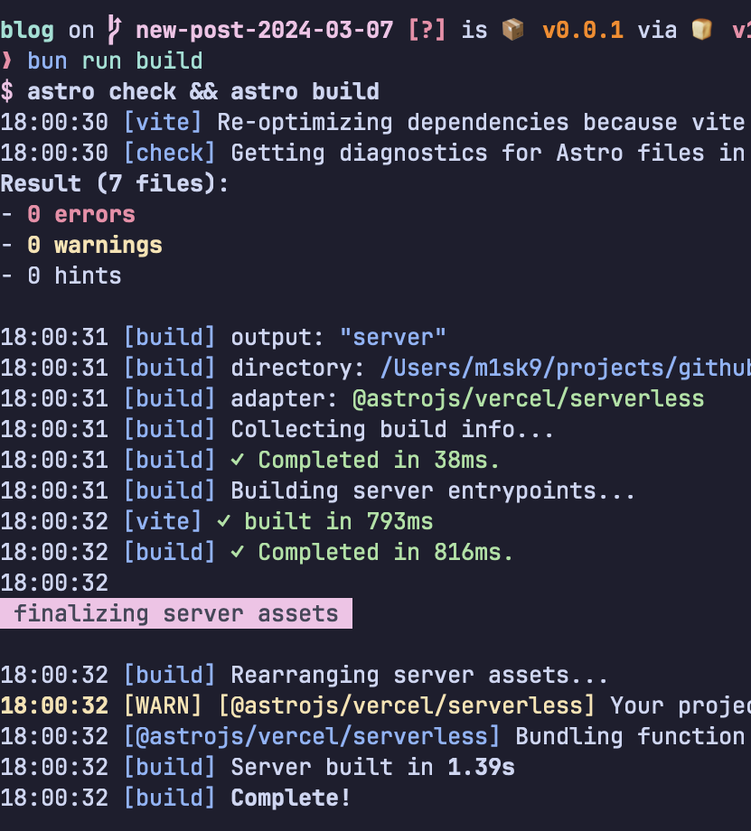

2024/03/07 にブログサイトを新しく作り直した. これだよ.

## なんで?

もともと技術系のことは Zenn とかに書いてたんだけど (Qiita? なにそれ) プログラミングのことからかけ離れたことを書きたいときとか, ちょっと思想に問題があることを自由に書きたいときに困ったからっていうのが主な理由なんだけど, それ以前に Deno っていうのがちょっとキツかった.

実は Deno, [Pulsate っていう分散型SNS](../2023/about-pulsate) の開発に採用したことがあったんだけど Import URL っていう設計思想が特殊すぎるのか, Renovate を使うことが出来ないという問題があって Node.js にした過去があり, また旧ブログサイトで使っていた Deno 公式のライブラリ [deno_blog] はコードブロックが使えなくてこれまた技術系ブログとは到底言えないものになっていたというのが2つめの理由. (なぜか JavaScript のコードブロックはレンダリングされてたので **そういうこと** か)

今はコードブロックも使えるぞ〜!

```rust
macro_rules! define_model {
    ($vis:vis $name:ident : $model:expr , rate = req $rreq:expr, res $rres:expr) => {
        $vis struct $name;

        impl Model for $name {
            const NAME: &'static str = $model;

            fn price_yen(req_tokens: usize, res_tokens: usize) -> f64 {
                // あくまでも概算なので, 浮動小数点数程度の精度で十分
                ($rreq * req_tokens as f64 + $rres * res_tokens as f64) / 1000.0 * 150.0
            }
        }
    };
}

// Note: https://platform.openai.com/docs/models/gpt-4-and-gpt-4-turbo
define_model!(pub GPT4Turbo:  "gpt-4-0125-preview", rate = req 0.01  , res 0.03  );
// Note: https://platform.openai.com/docs/models/gpt-3-5
define_model!(pub GPT35Turbo: "gpt-3.5-turbo-0125", rate = req 0.0010, res 0.0020);
```

## 技術スタック

**[You Don't Need Next.js](https://www.docswell.com/s/ashphy/KM1NQ6-you-dont-need-nextjs)** っていうことで Node.js は使いませんでした ([ポートフォリオ](https://m1sk9.dev) はガッツリ Node.js 使ってる. PandaCSS 最高〜〜〜)

前々から気になっていた Astro を使っています. めっちゃ簡単. `Astro.glob()` でMarkdown のデータを取得できるのが凄く画期的で流石に気持ちよかったよね. ([ドキュメント曰く色んなものを import できるらしい.](https://docs.astro.build/ja/guides/imports/))

```astro
const postsData = (await Astro.glob('./posts/**/*.md')).reverse();
---

<Layout title="m1sk9's blog" description="m1sk9 のブログサイトです">
  <main class="container">
    <Header />
    {
      postsData.map((post) => (
        <article>
          <h3>
            <a
              href={
                post.url ??
                (() => {
                  throw new Error(`url of ${post.file} is undefined`);
                })()
              }
            >
              {post.frontmatter.title}
            </a>
          </h3>
          <p>{post.frontmatter.description}</p>
        </article>
      ))
    }
```

ビルドが速すぎる. ビビったよ.



### Node.js? Deno? pnpm? パッケージマネージャーと Runtime って Bun 以外にあったっけ?

最近は Bun ばっかり使ってます. esbuild も vitest も負けたんです. こいつにはもう誰も勝てねぇ...

<blockquote class="twitter-tweet"><p lang="en" dir="ltr">bun:test ran 20x faster than vitest <a href="https://t.co/wUe3CK0XJM">pic.twitter.com/wUe3CK0XJM</a></p>&mdash; Jarred Sumner (@jarredsumner) <a href="https://twitter.com/jarredsumner/status/1632545090160975873?ref_src=twsrc%5Etfw">March 6, 2023</a></blockquote> <script async src="https://platform.twitter.com/widgets.js" charset="utf-8"></script>

ただ, ロックファイルがバイナリだからなのかはわからんが, `bun install` するたびにロックファイルが更新されるのはなんだろうか... `--frozen-lockfile` 毎回しろってことか...?

----

新しいブログサイト, いっぱい更新できるように頑張ります. [Pulsate](../2023/about-pulsate) の進捗出せるようになればいいなという気持ちです.
